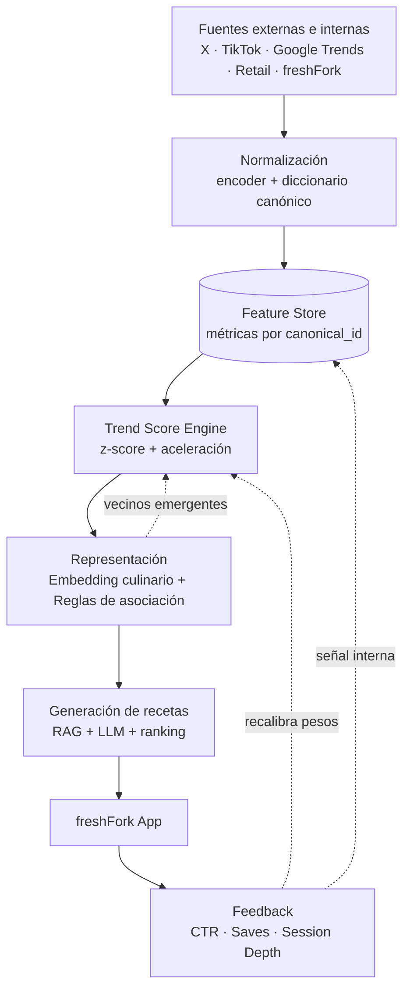

# Sistema de Recomendación Proactivo para Food Creators — freshFork

**Tiempo utilizado:** ~2 horas

---

## 1. Arquitectura End-to-End



El sistema opera como un ciclo continuo donde fuentes heterogéneas se mapean a un espacio común de ingredientes canónicos, sobre el cual se calculan tendencias y se generan recetas. El feedback loop ajusta los pesos por fuente según el engagement real observado.

---

## 2. Stack Técnico

| Capa | Tecnología | Justificación |
|---|---|---|
| Orquestación | Airflow / Step Functions | Pipelines con frecuencias diferenciadas, DAGs versionables |
| Ingesta + Storage | Python + S3 (crudo) + BBDD SQL de preferencia | Separación crudo/procesado, SQL para queries analíticos |
| Encoder de normalización | sentence-transformers / OpenAI embeddings | Pre-entrenado, fijo, robusto a variaciones léxicas |
| Base de datos vectorial | FAISS / pgvector | Lookup eficiente contra diccionario canónico |
| Trend scoring + reentrenamiento | scikit-learn, LightGBM | Modelos livianos, interpretables, fáciles de iterar |
| Embedding culinario | gensim Word2Vec sobre recetas | Captura relaciones culinarias por co-ocurrencia |
| Reglas de asociación | mlxtend (Apriori / FP-Growth) | Clásico, interpretable, alto valor para producto |
| Generación de recetas | Claude Sonnet / Haiku / GPT-4o | Calidad suficiente para redacción guiada por system prompt |
| Monitoreo | CloudWatch + dashboard interno | Alertas de drift, calidad de mapeos canónicos |

---

## 3. Ingesta y Normalización de Señales

### Taxonomía de fuentes por velocidad de señal

- **Señales tempranas (Twitter/X, TikTok):** Frecuencia 4-6hs. Capturan el momento en que un ingrediente empieza a generar interacciones. Ruidosas pero con ventaja temporal.
- **Señales de intención (Google Trends):** Frecuencia diaria. Puente entre awareness y acción ("recetas con X", "qué es X").
- **Señales de acción (Retail, OpenFoodFacts):** Frecuencia semanal/diaria. Compras reales, señal limpia pero más tardía.
- **Señales internas (freshFork):** Near-real-time. CTR, saves, búsquedas internas. Es la ground truth para calibrar los pesos del resto.

### Normalización por embedding similarity

El problema: `#Hummus`, `#humus`, `#HummusViral`, `#PastaDeGarbanzosTiktok` deben colapsar a un único `canonical_id: hummus`. La aproximación es resolución por similitud semántica contra un diccionario canónico, permitiendo determinismo y unificando la informacion:

| Paso | Descripción |
|---|---|
| Encoder embedding | Los ingredientes canónicos se embeben una sola vez y se indexan en la base de BBDD vectorial. |
| Matching por vecino más cercano | Cada término entrante se embebe on-the-fly y se busca el canonical_id más cercano por similitud de coseno. El match se acepta solo si supera un threshold alto (~0.80–0.85). Para hashtags ambiguos se embebe el hashtag con contexto del post para desambiguar. |
| Cola de revisión y crecimiento | Términos con confidence baja no se asignan por defecto, van a una cola. Periódicamente (semanal, batch), un proceso agrupa términos similares no resueltos y un LLM sugiere candidatos a nuevos canónicos — fuera del path crítico, controlado. |

**Ventajas:** determinístico, escalable, costo predecible, output siempre dentro del diccionario (sin alucinación). Las observaciones se agregan a nivel de `canonical_id`, ponderadas por `confidence`, en una tabla `(timestamp, source, canonical_id, signal_type, value, confidence)`.

```text
PROCEDIMIENTO normalize(raw_term, post_context):
    embedding ← encoder(raw_term + post_context)
    nearest, similarity ← vector_index.search(embedding, k=1)

    SI similarity ≥ threshold (~0.82):
        emitir (canonical_id = nearest, confidence = similarity)
    SINO:
        enviar a cola_de_revisión
```

---

## 4. Detección de Tendencias — Trend Score

El sistema unifica las señales heterogéneas en una métrica única por ingrediente que captura tanto magnitud como velocidad. Para cada ingrediente y fuente, se calculan dos componentes sobre ventanas móviles (7d, 30d, 90d):

- **Z-score** de la media corta contra la media y desvío de 90 días: cuánto se desvía el ingrediente de su propio baseline. Agnóstico a la escala original, este permite comparar señales de fuentes con magnitudes muy distintas.
- **Aceleración** como ratio entre media de 7d y media de 30d: detecta si la señal se está acelerando, no solo si es alta.

El score por fuente combina ambos componentes con pesos w1 y w2. El **trend score compuesto** es una suma ponderada de los scores por fuente, con pesos iniciales heurísticos (social 0.30, google trends 0.20, retail 0.30, internal 0.20) que se recalibran mensualmente con un modelo supervisado: target = engagement de la receta generada, features = source_scores al momento de detección. Los `feature_importances_` de un LightGBM dan los pesos actualizados, cerrando el feedback loop.

```text
PARA cada (ingrediente, fuente) en cada ciclo de ingesta:
    z_score      ← (media_7d − media_90d) / desvío_90d
    aceleración  ← (media_7d − media_30d) / media_30d
    source_score ← w1 · z_score + w2 · aceleración

trend_score(ingrediente) ← Σ peso[fuente] · source_score[fuente]

# Recalibración mensual de pesos:
# entrenar LightGBM con (source_scores históricos → engagement)
# pesos ← normalizar(model.feature_importances_)
```

### Clasificación

| Estado | Criterio | Acción |
|---|---|---|
| **Emergente** | Social alto, retail bajo, aceleración positiva | Monitorear, buscar vecinos semánticos, recetas experimentales |
| **Confirmada** | Social + retail altos, sostenido | Priorizar generación, posicionar en app |
| **Establecida** | Estable, aceleración ~0 | Mainstream. Criterio de negocio o datos internos definen si se sigue priorizando |

---

## 5. Representación de Ingredientes y Recetas

Conviven dos representaciones complementarias, con propósitos distintos:

### Embedding culinario (capa estática)

Word2Vec entrenado sobre recetas tratadas como secuencias de ingredientes canónicos. Captura relaciones culinarias de co-ocurrencia: los vecinos más cercanos de "hummus" son tahini, falafel, labneh. Se actualiza con baja frecuencia (mensual). Habilita la **predicción por similitud**: si el hummus está trending, sus vecinos semánticos con señales tempranas incipientes son candidatos a próxima tendencia. Operativamente, se filtran vecinos con similitud > 0.7 y z-score social > 1.0, y se rankean por el producto de ambos.s

### Reglas de asociación (retail + datos internos)

Capturan **patrones de consumo y consumo de contenido reales**, complementarios a la co-ocurrencia en recetas.

- **Enriquecimiento del espacio de ingredientes:** reglas sobre co-compras en retail y co-saves de recetas en una misma sesión detectan combinaciones validadas por consumo.
- **Tendencias compuestas:** lift alto entre dos ingredientes que suben juntos sugiere una tendencia macro (ej: hummus + labneh → cocina mediterránea), no dos eventos aislados.
- **Features de producto:** habilitan recomendaciones cross-receta tipo "frecuentemente combinado con", "completá tu menú", o secciones temáticas — features que mueven KPIs de engagement profundo (session depth, recetas por sesión).

### Representación de recetas

Cada receta se representa como **vector promedio de los embeddings culinarios de sus ingredientes**, ponderado por relevancia (los ingredientes principales pesan más que aderezos). Esto permite buscar recetas similares por similitud vectorial, calcular un score de tendencia por receta como suma ponderada de los trend scores de sus ingredientes, y hacer retrieval para RAG sobre lo existente.

---

## 6. Generación y Recomendación de Recetas

Pipeline RAG con tres etapas:

1. **Retrieval:** dado un ingrediente trending, se recuperan las top-n recetas más similares del banco interno (vector search sobre embeddings de recetas). El contexto se enriquece con reglas de asociación: "ingredientes frecuentemente combinados con X según consumo real".

2. **Generación:** el LLM recibe ingrediente trending + estado de tendencia + recetas similares + combinaciones frecuentes + restricciones (perfil nutricional, complejidad, tiempo). Genera N recetas originales. La generación es deliberadamente simple: los LLMs actuales producen recetas coherentes con alta confiabilidad. El valor del sistema está en qué generar y cuándo.

3. **Ranking y filtrado:** las recetas generadas se filtran por reglas básicas (coherencia, balance nutricional, viabilidad) y se rankean combinando, score, novelty (qué tan distinta es de las recientes), engagement con el usuario (preferencias históricas) y diversity (evitar saturación del feed).

Adicionalmente, las reglas de asociación alimentan un módulo **cross-recipe** que sugiere combinaciones tipo "esta receta va bien con X", aumentando recetas vistas por sesión.

---

## 7. Métricas y Experimentación

### Detección (offline)

- **Early Detection Rate:** % de ingredientes detectados como emergentes antes de su pico en retail. Mide ventaja temporal.
- **Precision de tendencias:** de los emergentes detectados, qué proporción efectivamente creció.
- **False Positive Rate:** trending detectados que nunca despegaron.

### Recomendación (offline)

- **Precision@k / Recall@k:** sobre recetas recomendadas vs. interacciones reales.
- **Novelty:** proporción de ingredientes nuevos para el usuario en recetas recomendadas.
- **Coverage:** % del catálogo de tendencias cubierto por recetas generadas.

### Online (KPIs de negocio)

- **CTR** en recetas con ingredientes trending vs. baseline.
- **Engagement profundo:** saves, shares, tiempo de lectura.
- **Session depth:** recetas vistas por sesión (impactado por cross-recipe).
- **Retention week-over-week** sobre usuarios expuestos a recomendaciones proactivas.
- **Lift en saves por usuario** vs. control.
- **Conversion:** usuarios que efectivamente prueban la receta (inferido por comportamiento posterior o self-reported).

### Experimento A/B

**Hipótesis:** las recetas basadas en ingredientes "emergentes" generan mayor engagement que las basadas en "establecidos".

- **Control:** feed con recetas de ingredientes establecidos.
- **Tratamiento:** feed con 20-30% de recetas de ingredientes emergentes detectados por el sistema.
- **Métricas primarias:** CTR, save rate, session depth.
- **Métricas guardrail:** retention, dwell time (evitar caída por saturación de "novedad").
- **Duración:** 4-6 semanas (ciclo completo de tendencia).

---

## 8. Trade-offs y Riesgos

| Riesgo | Impacto | Mitigación |
|---|---|---|
| **Cold start (ingredientes)** | Sin historial no hay baseline para z-score | Bootstrapping del diccionario desde catálogo interno + datasets nutricionales; embeddings infieren comportamiento esperado por similitud |
| **Cold start (usuarios)** | Recomendación sin historial individual | Fallback a tendencias confirmadas + reglas de asociación globales; personalización progresiva |
| **Data freshness** | Latencia entre señal real e ingesta | Frecuencias diferenciadas por fuente; alertas ante picos anómalos en redes |
| **Sesgos de plataforma** | TikTok/X sobrerepresentan ciertos demográficos | Pesos dinámicos por fuente + retail como ancla de realidad + monitoreo por segmento |
| **Calidad de normalización** | Términos ambiguos mal mapeados (ej: "pasta de palta" → hummus) | Threshold alto + diccionario canónico curado + monitoreo de drift en distribución de mapeos |
| **Hype sin sustancia** | Virales que no se traducen en consumo | Clasificación emergente/confirmada; priorizar generación solo en confirmadas |
| **Saturación del usuario** | Demasiadas recetas "trendy" cansan | Limitar proporción de recetas proactivas (20-30%), diversity en ranking, A/B continuo |
| **Drift del encoder** | Modelo pre-entrenado puede degradarse para jergas nuevas | Cola de revisión + crecimiento del diccionario; reevaluación periódica del threshold |
